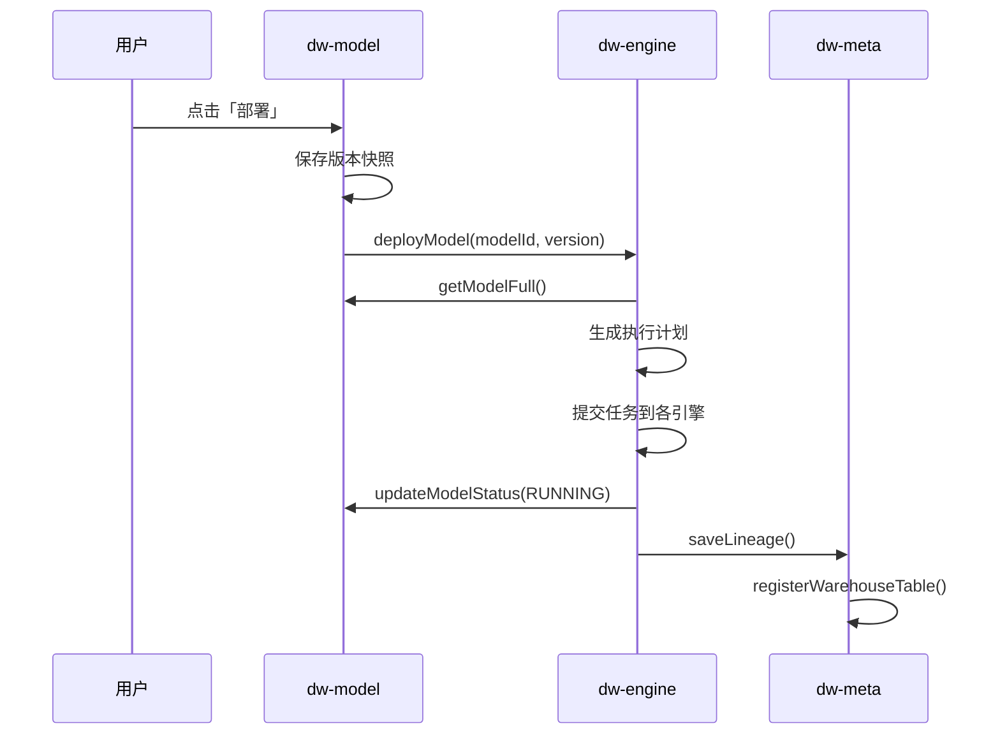

# Memory.md

## 项目概况

- **项目名称**: Puzzle DW（数据仓库平台）
- **项目类型**: 多租户 SaaS 数据仓库平台
- **版本**: 1.0
- **技术栈**: Java, Maven, Spring Boot, PostgreSQL, ClickHouse, Flink, Kafka, Iceberg
- **构建工具**: Maven
- **运行时版本**: Java 17+
- **部署环境**: 待定
- **关键依赖**: common-lib 1.4.0

## 架构设计

### 模块划分

| 模块                | 职责                                       | Domain 组织                                     |
|-------------------|------------------------------------------|---------------------------------------------|
| **puzzle-tenant** | 租户/用户/角色/权限管理                            | 单域（Tenant/User/Role/Permission 共用根目录）           |
| **puzzle-source** | 数据源管理、连通性测试                              | 单域（Datasource 根目录）                          |
| **puzzle-meta**   | Schema 采集、血缘追踪                           | 单域（Metadata 根目录）                          |
| **puzzle-model**  | 模型定义、拖拽建模、指标定义、自动生成执行计划                  | 多域（Model 根目录、metric/、dimension/）          |
| **puzzle-engine** | 执行引擎调度（SeaTunnel/Flink/DolphinScheduler） | 多域（engine/、task/）                          |
| **puzzle-query**  | 查询路由、SQL 生成、结果返回                         | 多域（query/、savedquery/）                      |
| **puzzle-system** | 审计日志、告警、系统配置                             | 单域（Audit/Alert 根目录）                        |
| **puzzle-ai**     | AI 智能问答、SQL 生成、指标推荐                      | 待定                                         |

### 核心业务流程



### 数据流向依赖图

```text
源数据库 (MySQL/PG)
    │ SeaTunnel CDC
    ▼
Kafka Topic
    │ Flink SQL (JOIN + AGG + FILTER)
    ▼
ClickHouse
    │ DolphinScheduler 定时归档
    ▼
Iceberg (S3/OSS)
```

## 核心组件

### puzzle-tenant

- **职责**: 租户/用户/角色/权限管理，认证授权
- **DDD 分层完整实现**:
  - `api`: TenantCmd/Query/Dto, UserCmd/Query/Dto, RoleCmd/Query/Dto, PermissionDto, TenantError/TenantException
  - `api/rpc`: PermissionRpc, TenantRpc
  - `biz`: TenantService, UserService, RoleService, PermissionService (接口)
  - `infra`: TenantRepo, UserRepo, RoleRepo, PermissionRepo (实现), JPA Entity + DAO
  - `server`: TenantController, UserController, RoleController, PermissionController, AuthController, AuthenticateServiceImpl
- **关键方法签名**:
  - `PermissionRepo.registerPermissions(String service, List<EndpointPermission>)` — 智能权限同步
  - `RoleRepo.updateRolePermission(RoleCmd.UpdateRolePermission)` — 批量绑定角色权限
  - `AuthenticateServiceImpl.registerPermissions(List<EndpointPermission>)` — 按 service 分组后调用 PermissionRepo
- **权限同步策略**:
  - 使用 `(service, path, method)` 作为稳定标识（API 的唯一标识）
  - `permissionCode` 可动态更新，不影响角色绑定
  - 删除前检查角色绑定，避免破坏已授权关系
  - 新增权限：`(path, method)` 不存在时创建
  - 修改权限：通过 `(path, method)` 匹配，更新 `permissionCode` 和 `description`
  - 删除权限：仅删除未绑定角色的权限，已绑定的记录警告并跳过
- **依赖**: common-lib (BaseRepository, DslQuery, JpaEntity, ServerResponse, EndpointPermission)

### puzzle-source

- **职责**: 数据源管理、连通性测试
- **实体**: Datasource (数据源配置)
- **枚举**: SourceType (MYSQL/POSTGRESQL等), SourceStatus (ACTIVE/DISABLED等)
- **RPC 接口**:
  - `DatasourceRpc.getConnConfig(Long datasourceId)` - 获取数据源连接配置（被 meta/engine 调用）
- **Service 接口**:
  - `DatasourceService` - 数据源管理服务（中文注释）

### puzzle-meta

- **职责**: Schema 采集、血缘追踪
- **实体**: Lineage (血缘关系), SourceTable (源表), SourceColumn (源表字段), WarehouseTable (仓库表), WarehouseColumn (仓库表字段)
- **枚举**: LineageEntityType (SOURCE_TABLE/MODEL/METRIC), LineageTransformType (DIRECT/AGGREGATION等), WarehouseStorageType (CLICKHOUSE/ICEBERG等)
- **RPC 接口**:
  - `MetadataRpc.syncSchema(Long datasourceId)` - 同步数据源 Schema（被 source 调用）
  - `MetadataRpc.getSourceTable(Long tableId)` - 获取源表信息（被 model 调用）
  - `MetadataRpc.listColumns(Long tableId)` - 获取表的字段列表（被 model 调用）
  - `MetadataRpc.saveLineage(Long modelId, String fromTables, String toTable)` - 保存血缘关系（被 engine 调用）
  - `MetadataRpc.registerWarehouseTable(Long modelId, String tableName)` - 注册数仓表（被 engine 调用）
- **Service 接口**:
  - `MetadataService` - 元数据管理服务（中文注释）

### puzzle-model

- **职责**: 模型定义、拖拽建模、指标定义、自动生成执行计划
- **实体**: Model (数据模型), ModelJoin (模型关联), ModelJoinCondition (关联条件), ModelField (模型字段), ModelVersion (模型版本), Metric (指标), Dimension (维度), OutputTable (输出表)
- **枚举**: JoinType, MetricType, MetricStatus, ModelType, AssignedEngine, AssignedStorage, ModelStatus, FieldRole, AggFunction, FilterOperator, DimensionType, OutputStorageType
- **RPC 接口**:
  - `ModelRpc.getModelFull(Long modelId)` - 获取模型完整定义（被 engine 调用）
  - `ModelRpc.updateModelStatus(Long modelId, ModelStatus status)` - 更新模型状态（被 engine 调用）
  - `ModelRpc.saveOutput(Long modelId, String outputTable)` - 保存模型产出表信息（被 engine 调用）
  - `ModelRpc.getModelOutputTable(Long modelId)` - 获取模型产出表名（被 query 调用）
  - `MetricRpc.getMetricFull(Long metricId)` - 获取指标完整定义（被 query 调用）
  - `DimensionRpc.getDimension(Long dimensionId)` - 获取维度定义（被 query 调用）
- **Service 接口**:
  - `ModelService` - 模型管理服务（中文注释）
  - `MetricService` - 指标管理服务（中文注释）
  - `DimensionService` - 维度管理服务（中文注释）
- **依赖**: query-api (使用 FilterCondition)

### puzzle-query

- **职责**: 查询路由、SQL 生成、结果返回
- **实体**: QueryRouteRule (查询路由规则), SavedQuery (保存的查询), QueryLog (查询日志)
- **枚举**: TargetEngine, QueryType, QueryStatus
- **共享 DTO**: FilterCondition (被 model 模块依赖)
- **Service 接口**:
  - `QueryService` - 查询服务（中文注释）
  - `SavedQueryService` - 保存查询服务（中文注释）

### puzzle-engine

- **职责**: 执行引擎调度（SeaTunnel/Flink/DolphinScheduler）
- **实体**: EngineTask (引擎任务), EngineTaskMetrics (任务指标), ExecutionPlan (执行计划)
- **枚举**: TaskType, EngineType, EngineTaskStatus, ExecutionPlanStatus
- **DTO**: SyncPlan, ComputePlan, ModelSnapshot
- **RPC 接口**:
  - `EngineRpc.deployModel(Long modelId)` - 部署模型到计算引擎（被 model 调用）
  - `EngineRpc.stopModel(Long modelId)` - 停止模型执行（被 model 调用）
  - `EngineRpc.restartModel(Long modelId)` - 重启模型执行（被 model 调用）
- **Service 接口**:
  - `EngineService` - 引擎管理服务（中文注释）
  - `EngineTaskService` - 引擎任务管理服务（中文注释）

### puzzle-system

- **职责**: 审计日志、告警、系统配置
- **RPC 接口**:
  - `AuditRpc.log(AuditLog)` - 记录审计日志（被所有模块调用）
  - `AuditRpc.batchLog(List<AuditLog>)` - 批量记录审计日志
  - `AlertRpc.fire(Alert)` - 触发告警（被 engine 调用）
  - `AlertRpc.resolve(Long alertId)` - 解除告警
- **状态**: 待实现

### puzzle-ai

- **职责**: AI 智能问答、SQL 生成、指标推荐
- **状态**: 待实现

## 进行中的工作

- 当前任务：API 模块按 domain 重新组织包结构
- 完成度：100%
- 已完成：
    - **Model 模块重构**：
      - Model domain：保持在 model-api 根目录（api 模块本身代表 Model domain）
      - Metric domain：创建 `metric/` 子目录
      - Dimension domain：创建 `dimension/` 子目录
      - 更新所有 import（ModelController, MetricRepo, DimensionRepo, MetricRpc, DimensionRpc）
    - **Query 模块重构**：
      - Query domain：创建 `query/` 子目录
      - SavedQuery domain：创建 `savedquery/` 子目录
      - 更新所有 import（QueryService, QueryRepo, SavedQueryRepo, QueryController）
    - **Engine 模块重构**：
      - Engine domain：创建 `engine/` 子目录
      - EngineTask domain：创建 `task/` 子目录
      - 更新所有 import（EngineRepo, EngineTaskRepo, EngineController）
      - 删除重复的 engine-biz/EngineService.java
    - **编译验证**：✓ Build passed
- 下一步：
    - 数据库 Schema 创建
    - DAO 和 Repository 实现
    - 集成测试
- 🚧 阻塞点：无

## 已知问题清单

| ID | 现象 | P级 | 影响范围 | 方案 | 状态 |
|----|----|----|------|----|----|
| 001 | data.sql 插入数据违反 biz_id 唯一约束 | P1 | 租户模块启动 | ON CONFLICT (id) → ON CONFLICT DO NOTHING | Fixed |
| 002 | engine 模块枚举使用 Lombok @AllArgsConstructor 导致编译失败 | P1 | engine 模块编译 | 改用手动构造器 + getter | Fixed |
| 003 | model 和 query 模块重复定义 FilterCondition | P1 | 模块间依赖 | model 依赖 query-api，删除重复定义 | Fixed |

### 001 号问题详情
- **错误**: `duplicate key value violates unique constraint "uk1686cdh02gqjwh4nktkjrwmna"`
- **原因**: `ON CONFLICT (id)` 只处理主键冲突，无法处理 biz_id 唯一约束冲突
- **解决**: 移除列名限制，改为 `ON CONFLICT DO NOTHING`，处理所有约束冲突
- **影响文件**: `tenant-server/src/main/resources/data.sql`

### 002 号问题详情
- **错误**: 枚举实现 CodeEnums 接口时，使用 Lombok @AllArgsConstructor 导致编译失败
- **原因**: Lombok 生成的构造器与 CodeEnums 接口要求不匹配
- **解决**: 移除 Lombok 注解，手动编写构造器和 getter 方法
- **影响文件**: EngineTaskStatus, EngineType, TaskType, ExecutionPlanStatus, EngineError

### 003 号问题详情
- **错误**: FilterCondition 在 model-api 和 query-api 中重复定义
- **原因**: 违反 DRY 原则，模块间应该通过依赖 API 包共享实体类
- **解决**: 保留 query-api 中的定义，model-infra 依赖 query-api
- **影响文件**: 删除 model-api/model/FilterCondition.java，更新 Metric.java import，model-infra/pom.xml 添加 query-api 依赖

## 编码约定

### 通用规范
- 命名规则：遵循 Java 标准命名规范
- 目录结构：DDD 分层（api/biz/infra/server）
- **包组织**：按 domain 分包，不按功能（Cmd/Dto/Query）分包
  - **单域模块**（如 source, meta, tenant, system）：
    - api 类直接放在模块根目录
    - 包名示例：`org.zhongmiao.puzzle.source.{Dto|Cmd|Query|Service}`
  - **多域模块**（如 model, query, engine）：
    - 每个业务域创建独立子目录
    - model 模块示例：
      ```
      model-api/.../puzzle/model/              # Model domain（根目录，api 本身代表 Model）
      model-api/.../puzzle/model/metric/       # Metric domain
      model-api/.../puzzle/model/dimension/    # Dimension domain
      ```
    - query 模块示例：
      ```
      query-api/.../puzzle/query/query/        # Query domain
      query-api/.../puzzle/query/savedquery/   # SavedQuery domain
      ```
    - engine 模块示例：
      ```
      engine-api/.../puzzle/engine/engine/     # Engine domain
      engine-api/.../puzzle/engine/task/       # EngineTask domain
      ```
  - **关键原则**：
    - 不要创建嵌套的 `model/model` 或 `query/query` 包
    - 对于多域模块，api 模块本身不代表某个特定 domain，需要为每个 domain 创建子目录
    - 但 model 模块特殊：model-api 本身代表 Model domain，所以 Model 类在根目录，其他 domain 用子目录
- 内部层（infra/entity）使用 `Long id`，外部层（api/DTO）使用 `String bizId`
- DAO 查询用 `DslQuery<>` + 字段命名约定（`xxxIn`, `xxxGe`, `xxxLike`, `xxxStartWith`）自动生成条件
- DAO 用 `default` 方法封装查询，不用 JPA 自动生成方法名查询
- BaseRepository 方法: `load()` 单个, `loads()` 多个, `page()` 分页, `delete()` 删除, `count()`, `exists()`, `stream()`
- 分页: `new DslQuery(); query.external(qry);` 自动映射前端分页参数（两步写法，external 返回基类）
- 事务内查询实体直接修改即可，JPA 自动更新，不需要 `save()`
- 批量操作: `loads()` + `toMap()` 代替循环 `load()`; `dao.delete(new Query().setIdIn(ids))` 代替循环删除
- 业务异常: `XxxException(XxxError.XXX)` 代替 `IllegalArgumentException`

### DslQuery 约定（重要）
| Suffix | SQL | Field Type | Example |
|--------|-----|------------|---------|
| (none) | `= ?` | Long/String | `Long modelId` |
| `In` | `IN (?)` | `Collection<Long>` | `Collection<Long> modelIdIn` |
| `Ge` | `>= ?` | LocalDateTime | `LocalDateTime createdAtGe` |
| `Le` | `<= ?` | LocalDateTime | `LocalDateTime createdAtLe` |
| `Like` | `LIKE %?%` | String | `String tableNameLike` |
| `StartWith` | `LIKE ?%` | String | `String codeStartWith` |

**重要约定**：`In` 后缀必须使用 `Collection<Long>`，不能用 `Collection<String>`

### RPC 接口规范
- **位置**: `api/rpc` 包
- **命名**: `{Domain}Rpc`
- **注释**: 必须**使用中文**，包括类注释、方法注释、参数说明
- **文档**: 记录被调用方模块（`被调用方: xxx, yyy`）
- **方法**: 只包含实际被其他模块调用的方法，避免冗余
- **示例**:
```java
/**
 * 数据源 RPC 服务
 * <p>
 * 被调用方: meta, engine
 */
public interface DatasourceRpc {
    /**
     * 获取数据源连接配置
     * <p>
     * 用于元数据同步和引擎执行
     *
     * @param datasourceId 数据源 ID
     * @return 连接配置
     */
    ConnConfig getConnConfig(Long datasourceId);
}
```

### Service 接口规范
- **位置**: `api` 包（不是 biz 包）
- **命名**: `{Domain}Service`
- **注释**: 必须**使用中文**
- **实现**: `infra/adapt` 包的 `{Domain}Repo` 类实现
- **示例**:
```java
/**
 * 模型管理服务接口
 */
public interface ModelService {
    /**
     * 创建模型
     */
    void createModel(ModelCmd.CreateModel cmd);

    /**
     * 查询模型列表（分页）
     */
    Page<ModelDto.ModelList> listModels(QueryRequest<ModelQuery.QueryModel> qry);
}
```

### 模块间依赖规范
- **原则**: 模块可以依赖其他模块的 `api` 包，**禁止重复定义 DTO**
- **依赖方向**: `infra → other-module-api`
- **共享实体**: 将共享 DTO 放在主要使用模块的 api 包，其他模块依赖使用
- **示例**: FilterCondition 被 model 和 query 共用，定义在 query-api，model-infra 依赖 query-api

### 实体类规范
- **命名**：
  - ❌ 不使用 `Puzzle` 前缀（如 `PuzzleModel`）
  - ✅ 直接使用业务名称（如 `Model`, `Metric`, `QueryLog`）
- **表名**：
  - ❌ 旧格式：`xxx_tbl`, `puzzle_xxx`
  - ✅ 新格式：`模块名_表名`（如 `model_metric`, `query_log`, `meta_source`）
- **注解**：
  - 必须添加 `@Data`, `@Entity`, `@Table`
  - 所有字段必须有中文注释
  - 枚举字段：`@Enumerated(EnumType.STRING)` + `@Column(length = 12, columnDefinition = "varchar(12)")`
  - JSON 字段：`@JdbcTypeCode(SqlTypes.JSON)` + `@Column(columnDefinition = "text")` + 专门的 Java 类型
- **继承**：
  - 租户相关：继承 `TenantEntity`
  - 非租户：继承 `JpaEntity`

### 枚举类规范（重要）
- **必须实现 `CodeEnums` 接口**
- **禁止使用 Lombok 的 `@AllArgsConstructor`**
- **必须手动编写构造器和 getter 方法**
- **code 类型**：使用 `Integer`，从 1 开始递增
- **message 类型**：使用 `String`，必须是中文描述
- **包位置**：`{module}-api/src/main/java/org/zhongmiao/puzzle/{module}/enums/`
- **正确示例**：
```java
public enum XxxStatus implements CodeEnums {
    ACTIVE(1, "激活"),
    INACTIVE(2, "停用");

    private final Integer code;
    private final String message;

    XxxStatus(Integer code, String message) {
        this.code = code;
        this.message = message;
    }

    public Integer getCode() {
        return code;
    }

    public String getMessage() {
        return message;
    }
}
```

### JSON 字段规范
- **类型选择**：
  - 简单类型：直接使用 `List<String>`, `List<Long>`, `Map<String, Object>`
  - 复杂结构：创建专门的 DTO 类
- **DTO 要求**：
  - 必须实现 `Serializable` 接口
  - 使用 `@Data` 注解
  - 包位置：`{module}-api/src/main/java/org/zhongmiao/puzzle/{module}/model/`
- **字段注解**：
  ```java
  @JdbcTypeCode(SqlTypes.JSON)
  @Column(columnDefinition = "text")
  private XxxConfig config;
  ```

### DAO 规范
- **继承**：继承 `BaseRepositoryImpl<Xxx>`（不是 `BaseRepository`）
- **注解**：添加 `@Component`
- **内部类**：创建 `QueryXxx extends DslQuery<Xxx>`
- **方法命名**：
  - `findById(Long id)` - 根据 ID 查询（内部用 Long）
  - `existsByXxx(Type xxx)` - 判断是否存在
  - 业务方法：`findByXxx(Type xxx)` - 根据业务字段查询

### 异常处理规范
- **Error 枚举**（api 包）：
  - 实现 `CodeEnums` 接口
  - 定义错误码（Integer code，建议从 40001 开始）
  - 定义错误信息（中文 message）
  - 使用 Lombok `@Getter` 和 `@AllArgsConstructor`
- **Exception 类**（api 包）：
  - 继承 `BizException`
  - 提供 `XxxException(XxxError error)` 构造器
  - 调用 `super(error.getCode(), error.getMessage())`
- **使用方式**：
  ```java
  // 抛出异常
  throw new ModelException(ModelError.MODEL_NOT_EXISTS);

  // 不要使用
  throw new IllegalArgumentException("模型不存在");
  ```

### 事务规范
- **写方法**（create/update/delete）：
  - 添加 `@Transactional(rollbackFor = Exception.class)`
  - 必须指定 `rollbackFor = Exception.class`
- **查询方法**（get/list/query）：
  - **不加** `@Transactional` 注解
  - 让 Spring 默认的事务行为处理

### 分页返回规范
- **Service 层**：返回 `Page<T>`（Spring Data JPA）
- **Controller 层**：包装为 `ServerResponse.success(List<T>)`
- **示例**：
```java
// Service
Page<ModelDto.ModelList> listModels(QueryRequest<...> qry);

// Controller
ServerResponse<List<ModelDto.ModelList>> listModels(...) {
    Page<ModelDto.ModelList> page = modelService.listModels(qry);
    return ServerResponse.success(page.getContent());
}
```

### 禁止事项
- 禁止在循环内进行 DB 访问
- 禁止硬编码魔法值
- 禁止手动编写 getter/setter（使用 Lombok @Data）
- 禁止用 `get(0)`，用 `findFirst()` 或 `load()`
- 禁止实体类使用 `Puzzle` 前缀
- 禁止 JSON 字段使用 `String` 类型
- 禁止枚举使用 `String code`（必须用 `Integer`）
- **禁止枚举使用 Lombok `@AllArgsConstructor`**
- **禁止跨模块重复定义 DTO**（应依赖 api 包）
- **禁止 RPC/Service 接口使用英文注释**（必须用中文）
- **禁止在查询方法上加 `@Transactional`**
- **禁止使用 `IllegalArgumentException`**（用自定义异常）

## 代码质量约束

**单一职责**：每个类只有一个变更理由
**代码体积**：单文件 ≤ 200 行
**控制流**：Guard Clauses 优先，嵌套最多 2 层
**注释**：只解释「为什么」，不解释「是什么」

**禁止**

- 循环内做 DB 访问或外部 API 调用
- 硬编码魔法值

**测试**：使用 Mock 数据，不依赖真实 DB 数据

---

*Last updated: 2026-02-28 — API 模块按 domain 重新组织包结构*

---

**UPDATED — 本次更新章节：**
- 架构设计 → 模块划分表格新增 Domain 组织说明
- 编码约定 → 通用规范新增包组织详细说明（单域 vs 多域模块）
- 进行中的工作 → API 模块按 domain 重新组织包结构
