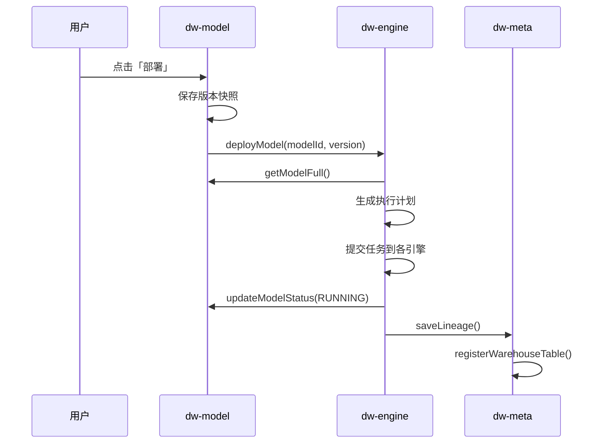

# Memory.md

## 项目概况
- **项目名称**: Puzzle DW（数据仓库平台）
- **项目类型**: 多租户 SaaS 数据仓库平台
- **版本**: 1.0
- **技术栈**: Java, Maven, Spring Boot, PostgreSQL, ClickHouse, Flink, Kafka, Iceberg
- **构建工具**: Maven
- **运行时版本**: Java 17+
- **部署环境**: 待定
- **关键依赖**: common-lib 1.4.0

## 架构设计

### 模块划分

| 模块 | 职责 |
|------|------|
| **puzzle-tenant** | 租户/用户/角色/权限管理 |
| **puzzle-source** | 数据源管理、连通性测试 |
| **puzzle-meta** | Schema 采集、血缘追踪 |
| **puzzle-model** | 模型定义、拖拽建模、指标定义、自动生成执行计划 |
| **puzzle-engine** | 执行引擎调度（SeaTunnel/Flink/DolphinScheduler） |
| **puzzle-query** | 查询路由、SQL 生成、结果返回 |
| **puzzle-system** | 审计日志、告警、系统配置 |
| **puzzle-ai** | AI 智能问答、SQL 生成、指标推荐 |

### 核心业务流程



### 数据流向依赖图

```text
源数据库 (MySQL/PG)
    │ SeaTunnel CDC
    ▼
Kafka Topic
    │ Flink SQL (JOIN + AGG + FILTER)
    ▼
ClickHouse
    │ DolphinScheduler 定时归档
    ▼
Iceberg (S3/OSS)
```

## 核心组件

### [组件名]
- 职责
- 关键方法签名
- 依赖组件（只列直接依赖）
- 性能基准：`xx ms@yy qps` 或 `xx MB/xx MB max`

## 进行中的工作
- 当前任务：所有微服务模块 DDD 结构完成
- 完成度：100%
- 已完成：
  - Maven 多模块项目结构搭建
  - 8 个微服务模块完整架构（tenant, source, meta, model, query, engine, system, ai）
  - 所有模块的 DDD 分层（api/biz/infra/server）
  - 使用 Lombok 简化 DTO 类
  - 项目文档编写
  - Git 仓库初始化并推送
- 下一步：
  - Infra 层：Entity、Dao、Repository 实现
  - Biz 层：Service 实现类
  - Server 层：RPC 实现类、Controller 完善接口
  - 数据库 Schema 设计与创建
- 🚧 阻塞点：无

## 已知问题清单
| ID | 现象 | P级 | 影响范围 | 方案 | 状态 |
| --- | --- | --- | --- | --- | --- |

## 编码约定
- 命名规则：遵循 Java 标准命名规范
- 目录结构：DDD 分层（api/biz/infra/server）
- 禁止事项：
  - 禁止在循环内进行 DB 访问
  - 禁止硬编码魔法值
  - 禁止手动编写 getter/setter（使用 Lombok @Data）

## 代码质量约束
**单一职责**：每个类只有一个变更理由
**代码体积**：单文件 ≤ 200 行
**控制流**：Guard Clauses 优先，嵌套最多 2 层
**注释**：只解释「为什么」，不解释「是什么」

**禁止**
- 循环内做 DB 访问或外部 API 调用
- 硬编码魔法值

**测试**：使用 Mock 数据，不依赖真实 DB 数据

---

*Last updated: 2026-02-26 18:00*
