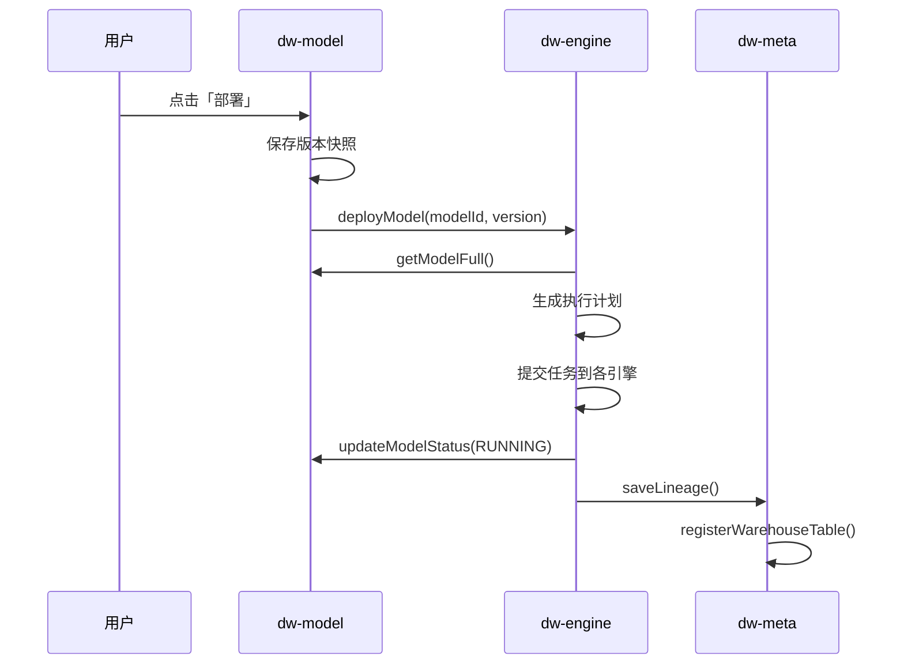

# Memory.md

## 项目概况

- **项目名称**: Puzzle DW（数据仓库平台）
- **项目类型**: 多租户 SaaS 数据仓库平台
- **版本**: 1.0
- **技术栈**: Java, Maven, Spring Boot, PostgreSQL, ClickHouse, Flink, Kafka, Iceberg
- **构建工具**: Maven
- **运行时版本**: Java 17+
- **部署环境**: 待定
- **关键依赖**: common-lib 1.4.0

## 架构设计

### 模块划分

| 模块                | 职责                                       |
|-------------------|------------------------------------------|
| **puzzle-tenant** | 租户/用户/角色/权限管理                            |
| **puzzle-source** | 数据源管理、连通性测试                              |
| **puzzle-meta**   | Schema 采集、血缘追踪                           |
| **puzzle-model**  | 模型定义、拖拽建模、指标定义、自动生成执行计划                  |
| **puzzle-engine** | 执行引擎调度（SeaTunnel/Flink/DolphinScheduler） |
| **puzzle-query**  | 查询路由、SQL 生成、结果返回                         |
| **puzzle-system** | 审计日志、告警、系统配置                             |
| **puzzle-ai**     | AI 智能问答、SQL 生成、指标推荐                      |

### 核心业务流程



### 数据流向依赖图

```text
源数据库 (MySQL/PG)
    │ SeaTunnel CDC
    ▼
Kafka Topic
    │ Flink SQL (JOIN + AGG + FILTER)
    ▼
ClickHouse
    │ DolphinScheduler 定时归档
    ▼
Iceberg (S3/OSS)
```

## 核心组件

### puzzle-tenant

- **职责**: 租户/用户/角色/权限管理，认证授权
- **DDD 分层完整实现**:
  - `api`: TenantCmd/Query/Dto, UserCmd/Query/Dto, RoleCmd/Query/Dto, PermissionDto, TenantError/TenantException
  - `biz`: TenantService, UserService, RoleService, PermissionService (接口)
  - `infra`: TenantRepo, UserRepo, RoleRepo, PermissionRepo (实现), JPA Entity + DAO
  - `server`: TenantController, UserController, RoleController, PermissionController, AuthController, AuthenticateServiceImpl
- **关键方法签名**:
  - `PermissionRepo.registerPermissions(String service, List<EndpointPermission>)` — 智能权限同步
  - `RoleRepo.updateRolePermission(RoleCmd.UpdateRolePermission)` — 批量绑定角色权限
  - `AuthenticateServiceImpl.registerPermissions(List<EndpointPermission>)` — 按 service 分组后调用 PermissionRepo
- **权限同步策略**:
  - 使用 `(service, path, method)` 作为稳定标识（API 的唯一标识）
  - `permissionCode` 可动态更新，不影响角色绑定
  - 删除前检查角色绑定，避免破坏已授权关系
  - 新增权限：`(path, method)` 不存在时创建
  - 修改权限：通过 `(path, method)` 匹配，更新 `permissionCode` 和 `description`
  - 删除权限：仅删除未绑定角色的权限，已绑定的记录警告并跳过
- **依赖**: common-lib (BaseRepository, DslQuery, JpaEntity, ServerResponse, EndpointPermission)

## 进行中的工作

- 当前任务：权限管理功能完善
- 完成度：100%
- 已完成：
    - PermissionDto 字段对齐数据库：service, permissionCode, description, path, method
    - 智能权限同步逻辑实现：
      - 使用 (service, path, method) 作为稳定标识
      - permissionCode 可动态更新，保留角色绑定
      - 删除前检查角色绑定，避免破坏已授权关系
    - DAO 方法扩展：
      - `PermissionDao.findByServiceAndPathAndMethod()` — 通过接口标识查询
      - `RoleDao.findByPermissionsId()` — 查找使用指定权限的角色
      - `RoleDao.countByPermissionsId()` — 统计权限绑定角色数
    - 映射工具类：PuzzlePermissionToPermissionDtoMapper
- 下一步：
    - 其他微服务模块 (source, meta, model, query, engine, system, ai) 的 CRUD 实现
    - 数据库 Schema 设计与创建
    - 集成测试
- 🚧 阻塞点：无

## 已知问题清单

| ID | 现象 | P级 | 影响范围 | 方案 | 状态 |
|----|----|----|------|----|----|

## 编码约定

- 命名规则：遵循 Java 标准命名规范
- 目录结构：DDD 分层（api/biz/infra/server）
- API 层 ID 一律用 `String bizId`，不用 `Long id`，不需要 `Long.valueOf()` 转换
- DAO 查询用 `DslQuery<>` + 字段命名约定（`xxxIn`, `xxxGe`, `xxxLike`, `xxxStartWith`）自动生成条件
- DAO 用 `default` 方法封装查询，不用 JPA 自动生成方法名查询
- BaseRepository 方法: `load()` 单个, `loads()` 多个, `page()` 分页, `delete()` 删除, `count()`, `exists()`, `stream()`
- 分页: `new DslQuery(); query.external(qry);` 自动映射前端分页参数（两步写法，external 返回基类）
- 事务内查询实体直接修改即可，JPA 自动更新，不需要 `save()`
- 批量操作: `loads()` + `toMap()` 代替循环 `load()`; `dao.delete(new Query().setBizIdIn(ids))` 代替循环删除
- 业务异常: `TenantException(TenantError.XXX)` 代替 `IllegalArgumentException`
- 禁止事项：
    - 禁止在循环内进行 DB 访问
    - 禁止硬编码魔法值
    - 禁止手动编写 getter/setter（使用 Lombok @Data）
    - 禁止用 `get(0)`，用 `findFirst()` 或 `load()`

## 代码质量约束

**单一职责**：每个类只有一个变更理由
**代码体积**：单文件 ≤ 200 行
**控制流**：Guard Clauses 优先，嵌套最多 2 层
**注释**：只解释「为什么」，不解释「是什么」

**禁止**

- 循环内做 DB 访问或外部 API 调用
- 硬编码魔法值

**测试**：使用 Mock 数据，不依赖真实 DB 数据

---

*Last updated: 2026-02-27 — 权限管理功能完善（DTO 对齐 + 智能同步）*

---

**UPDATED — 本次更新章节：**
- 核心组件 → puzzle-tenant
- 进行中的工作
